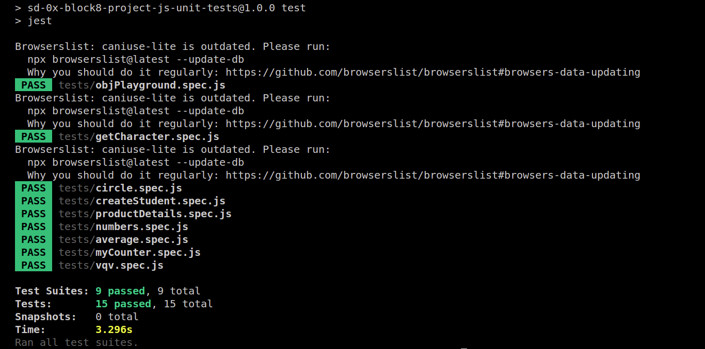

# Unit tests

# Contexto
O objetivo deste projeto é consolidar o conhecimento adquirido sobre testes unitários com Jest. Foram implementadas funções baseadas no que os testes esperavam e também testes baseados no compartamento de funções já implementadas. 

# Propriedade Intelectual
**As partes feitas por mim neste projeto, são:**

**Arquivos**
- `average.js`
- `vqv.js`
- `createStudent.js`
- `objPlayground.js`
- `myCounter.js`

**Testes**

- `circle.spec.js`
- `productDetails.spec.js`
- `getCharacter.spec.js`
- `numbers.spec.js`

**Todos os outros arquivos da aplicação são propriedade intelectual da Trybe. Eles foram fornecidos somente para a realização do projeto.**

## Habilidades Desenvolvidas

- Escrever testes unitários para funções utilizando Jest para verificar o correto funcionamento dessas funções;
- A partir de testes já implementados, escrever funções de forma que elas atendam aos testes propostos;
- Escrever testes e funções utilizando uma abordagem de desenvolvimento orientado a testes.

---

## Resultado dos Testes



## Ferramentas utilizadas

> Linguagem: `Javascript`

> Testes: `Jest`

## Para clonar esse repositório:
1 - **Clonar projeto locamente**
```bash
git clone git@github.com:imgeff/unit-tests.git
```

## Instalando Dependências

2 - **Entrar na  pasta do projeto**
```bash
cd unit-tests
```
3 - **Instalar Dependências**
```bash
npm install
```
## Executando Testes

* Para rodar todos os testes:

```
  npm test
```